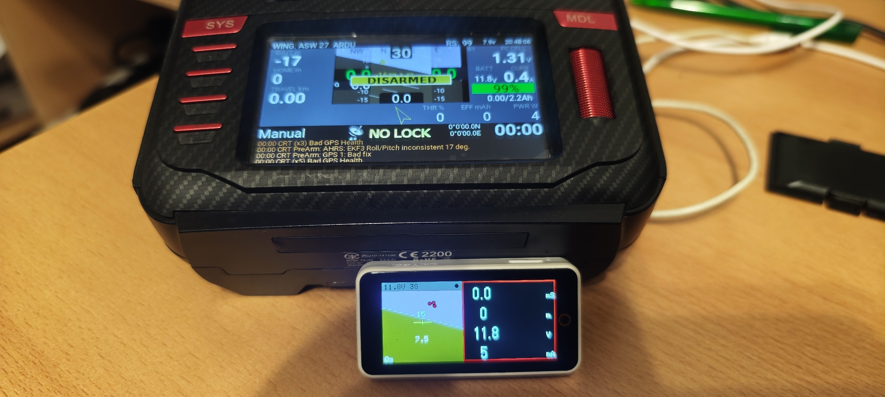
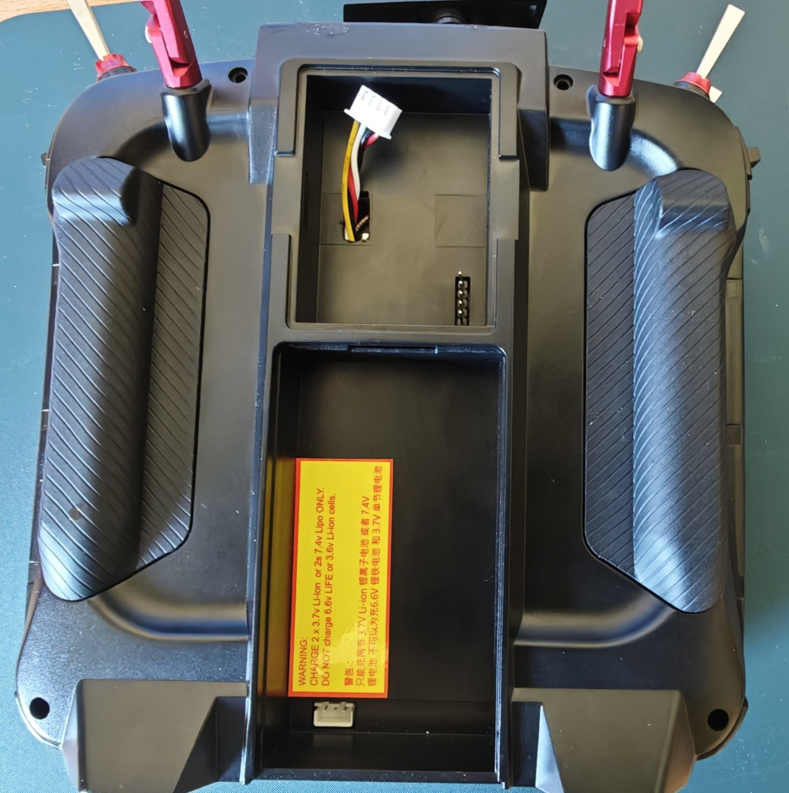
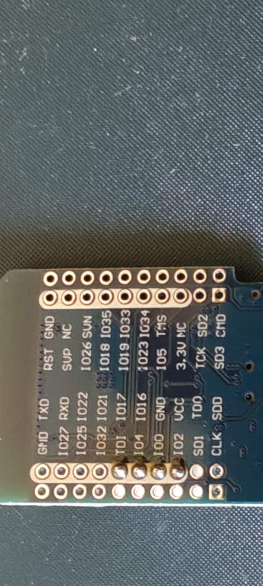

# 🛰️ Bluetooth Bridge for RadioMaster (TX16S, Boxer, TX12, Zorro) & EdgeTX
### (Optimized for Teleview Project & Telemetry Viewer App)

Dieses ESP32-Projekt realisiert ein universelles Telemetrie-Gateway namens
**Bluetooth Bridge**. Es wurde speziell für das selbst entwickelte
[Teleview-Projekt](../Teleview) (wird noch veröffentlicht) und die offizielle
[Telemetry Viewer App](https://play.google.com/store/apps/details?id=crazydude.com.telemetry&hl=de)
entwickelt.

### 📱 Das fertige Telemetrie-Cockpit im Betrieb:

*Die Telemetry Viewer App auf dem Smartphone mit aktivem künstlichen Horizont.*

*Das selbst entwickelte Teleview-Modul (Lilygo T-Display-S3 Plus) im Live-Betrieb.*

Das Modul funktioniert an jeder EdgeTX-Fernsteuerung mit freiem UART:
* RadioMaster TX16S / TX16S MKII (interner Bluetooth-Port)
* RadioMaster Boxer (interner UART-Anschluss)
* RadioMaster TX12 / TX12 MKII & RadioMaster Zorro
* Jumper T18 / T18 Pro (Unterbringung im JR-Schacht)

---

## 📸 Mechanischer Aufbau (Geringer Aufwand)

Es müssen lediglich 4 dünne Kabel (Signal, Strom, Masse) gelötet werden.

### Anschluss als externes Modul zum Test:
Die Schnittstelle ist am Sender von außen frei zugänglich, sodass zum Testen
des Moduls der Sender nicht geöffnet werden muss.

### Unterbringung im externen JR-Modulschacht:
Das kompakte Modul liegt flach im leeren Modulschacht auf der Rückseite des
Senders. Ein vieradriges Kabel wird intern an der Hauptplatine angelötet, nach
hinten in den Schacht geführt und bleibt über einen XH-Stecker jederzeit trennbar.

### Das vorbereitete Telemetriemodul:
Das MINI32-Board geschützt im Schrumpfschlauch mit frei zugänglicher XH-Buchse.

---

## 🚨 Warum dieses Modul benötigt wird

Einfache "Serial-to-Serial" Bluetooth-Module übertragen die Daten zwar, haben
jedoch **keinen Nutzen beim Empfänger**.

Das Multiprotokollmodul (MPM) liefert anders strukturierte Daten als ein reiner
FrSky-Sender. Ohne die Echtzeit-Umsetzung dieses Projekts können FrSky-basierte
Apps und Displays die Rohdaten nicht interpretieren. Es werden keine Daten
angezeigt.

Diese Firmware übersetzt die Daten und ermöglicht erst den fehlerfreien Betrieb
des [Teleview-Moduls](../Teleview) und der
[Telemetry Viewer App](https://play.google.com/store/apps/details?id=crazydude.com.telemetry&hl=de).

---

## 📖 Anleitung & Technische Details

Die PlatformIO-Flashanleitung, Protokoll-Details (FrSky, Yaapu, Graupner HoTT)
und die genauen EdgeTX-Hardware-Menüeinstellungen finden Sie hier:

➔ **[Zur detaillierten Installations-Anleitung (DETAILS.md)](DETAILS.md)**

---

⚠️ **Hinweis zur Kompatibilität:**
Das System wurde ausgiebig und erfolgreich auf der **RadioMaster TX16S** 
getestet. Da die anderen genannten Sender ebenfalls EdgeTX nutzen und über 
kompatible UART-Schnittstellen verfügen, ist das Modul dort hardwareseitig 
einsetzbar – ein realer Praxistest auf diesen Modellen steht jedoch noch aus.

---

## 📜 Lizenz

**MIT License** - Frei für alle Freunde von EdgeTX!
